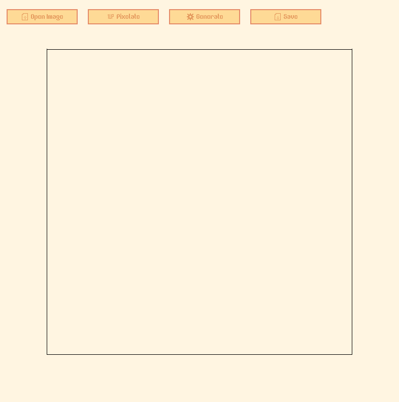

# Nobonoko (Album Cover) Generator

A raylib+raygui program that can transform any .png file into a [nobonoko](https://www.youtube.com/@nobonokomusic)-esque album cover image.



[nobonoko](https://www.youtube.com/@nobonokomusic) is a music artist that I listen to (pretty much) every time I write code. A signature look for some of his albums is this pixel art bubble effect, and I wanted to challenge myself and write an automated way to do this.

Here are some of the albums:
- [PLNR (2022)](https://www.youtube.com/watch?v=sb-NffD6Nzc&t=151s)
- [Television (2024)](https://www.youtube.com/watch?v=6-aX4rsb3fw)
- [Swamp (2023)](https://www.youtube.com/watch?v=SsHOS_wOM7Q)

### ⚠️ **Warning**

This is still in development:
- It **only** works with .png files
- Transparent images look buggy (they are not if you save them)

## Prerequisites

- [Raylib](https://github.com/raysan5/raylib#build-and-installation).
- g++ (MinGW if you are on Windows)

## Installation

To get started with this project, clone the repository and compile the project using the provided `Makefile`.

```bash
git clone https://github.com/ikugo-dev/nobonoko-generator.git
cd nobonoko-generator
make
```
### ⚠️ **Warning for Windows users**
You need to have MinGW with g++ if you want to compile it.

## Running the Project

Once compiled, run the project with `./nobonoko`

or double click `nobonoko.exe` if you are on Windows.

## How to Use

Go from left to right:

- Open an image you want to transform (**MUST BE .png**)
- Pixelate it
- Generate the lines as many times as you want (until you get the right colour)
- Save (if you want to, no judgement here)

Tip: Press **t** on your keyboard to change the theme!
